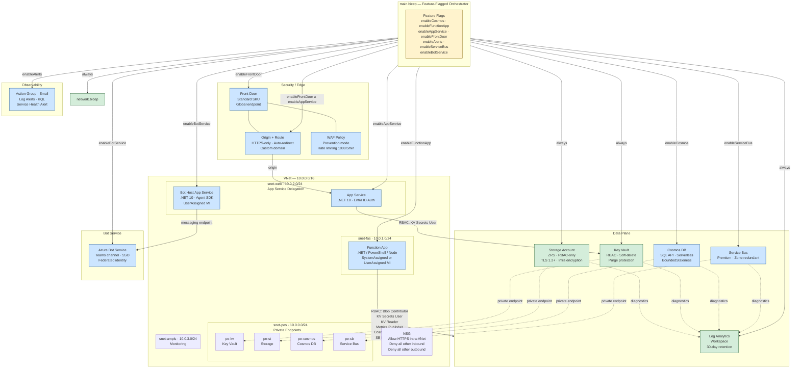
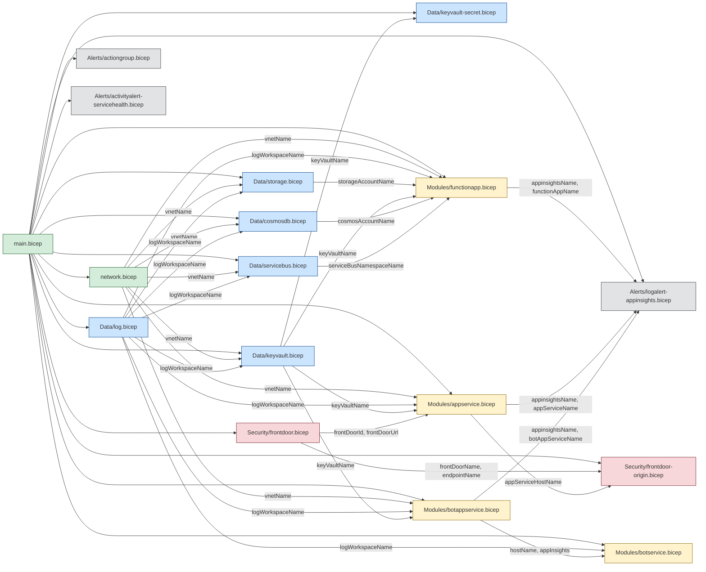

# Architecture Overview

This document visualises the modular Azure architecture deployed by `Infrastructure/main.bicep`.

## System Topology

## Module Dependency Graph

## Private Endpoint & DNS Pattern

Every data-plane service follows the same four-resource pattern inside `snet-pes`:

| # | Resource | Purpose |
|---|----------|---------|
| 1 | Service (e.g. Key Vault) | The actual Azure resource with `publicNetworkAccess: 'Disabled'` |
| 2 | Private Endpoint (`pe-*`) | NIC in `snet-pes` linked to the service via `privateLinkServiceConnections` |
| 3 | Private DNS Zone (`privatelink.*`) | Resolves the service FQDN to the private IP |
| 4 | VNet Link (`pdz-*-link`) | Connects the DNS zone to the VNet for automatic resolution |

Services using this pattern: **Key Vault**, **Storage Account**, **Cosmos DB**, **Service Bus**.

## Subnet Purpose Matrix

| Subnet | CIDR | Delegation | Hosts |
|--------|------|------------|-------|
| `snet-pes` | 10.0.0.0/24 | None | Private endpoints for KV, Storage, Cosmos, Service Bus |
| `snet-fas` | 10.0.1.0/24 | `Microsoft.Web/serverFarms` | Function App VNet integration |
| `snet-web` | 10.0.2.0/24 | `Microsoft.Web/serverFarms` | App Service + Bot Host App Service VNet integration |
| `snet-ampls` | 10.0.3.0/24 | None | Azure Monitor Private Link Scope (reserved) |

## NSG Rules Summary

| Rule | Direction | Priority | Source / Dest | Port | Action |
|------|-----------|----------|---------------|------|--------|
| AllowVnetHTTPSInbound | Inbound | 100 | VirtualNetwork → VirtualNetwork | 443 | Allow |
| DenyAllInbound | Inbound | 4096 | * → * | * | Deny |
| AllowVnetHTTPSOutbound | Outbound | 100 | VirtualNetwork → VirtualNetwork | 443 | Allow |
| DenyAllOutbound | Outbound | 4096 | * → * | * | Deny |

## RBAC Role Assignments

The Function App module assigns these roles to its managed identity:

| Role | Scope | Well-known ID |
|------|-------|---------------|
| Storage Blob Data Contributor | Storage Account | `ba92f5b4-2d11-453d-a403-e96b0029c9fe` |
| Monitoring Metrics Publisher | Application Insights | `3913510d-42f4-4e42-8a64-420c390055eb` |
| Key Vault Secrets User | Key Vault | `4633458b-17de-408a-b874-0445c86b69e6` |
| Key Vault Reader | Key Vault | `21090545-7ca7-4776-b22c-e363652d74d2` |
| Cosmos DB Contributor (SQL) | Cosmos DB Account | Built-in `00000000-…-000002` |
| Service Bus Data Receiver | Service Bus Namespace | `4f6d3b9b-027b-4f4c-9142-0e5a2a2247e0` |
